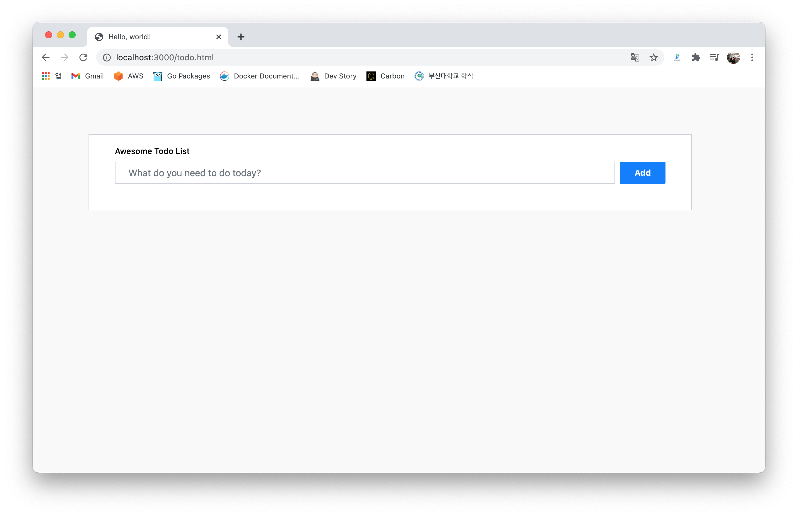

# Go로 만드는 ToDo list
Youtube 'tucker'님의 강의를 참고하면서 ToDo 리스트 웹서비스를 만들어 보았습니다.
 
 

## Front-End
**bootstrap**의 todo list template example 사용.
<https://bbbootstrap.com/snippets/awesome-todo-list-template-25095891>

## Back-End
#### API 목록
|URL|Method|역할|
|---|:---:|---
|"/"|-|인덱스 페이지로 redirect|
|"/todos"|GET|DB에서 현재 세션 ID와 일치하는 항목들을 가져옴|
|"/todos"|POST|입력한 이름의 항목을 추가|
|"/todos/{id:[0-9]+}"|DELETE|ID와 일치하는 항목을 삭제|
|"/complete-todo/{id:[0-9]+}"|GET|ID와 일치하는 항목의 수행 상태를 바꿈|
|"/auth/google/login"|-|쿠키를 받아서 Google 로그인 하는 주소로 redirect|
|"/auth/google/callback"|-|사용자 정보를 받아서 세션 정보를 얻고 인덱스 페이지로 redirect|

#### DB
연습을 위한 용도이기 때문에 fileDB(sqlite3) 사용

#### Package
- gorilla mux로 라우팅 구현
- negroni로 미들웨어 추가
	+ 데코레이터 패턴 적용
	+ 구글 OAuth 로그인이 잘 되었는지 확인하는 핸들러 function 추가
- render로 JSON 렌더링 수행